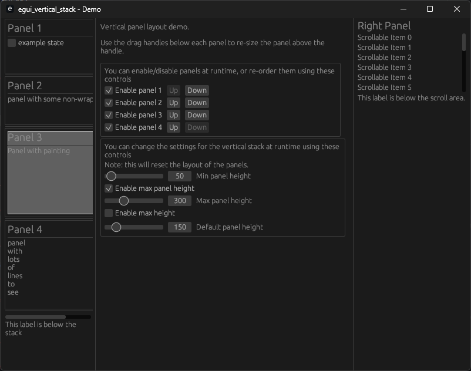

# egui_vertical_stack

A vertical stack of panels.

* Each panel is resizable using a drag handle beneath each panel. 
* Panels can be added/removed/re-ordered at runtime.
* The entire stack is contained in a scroll-area, with support for vertical and horizontal scrolling.
* The min/max/default sizes can be configured.
* The stack of panels can have a maximum height.
* Other elements can be rendered after the stack.

## Demos

The crate contains 2 demos, simple (to get you started) and complex (to show you all the features).

Refer to the `demos` folder.

## Screenshot

Here's a recent screenshot of the complex demo:

## License

Available under APACHE *or* MIT licenses.

* [APACHE](LICENSE-APACHE)
* [MIT](LICENSE-MIT)

## Authors

* Dominic Clifton - Project founder and primary maintainer.

## Timeline

2025/06/23 - This originally started as a crate in the MakerPnP main repository.
2025/06/25 - Moved to separate repository.

## Links

* Patreon: https://www.patreon.com/MakerPnP
* Github: https://github.com/MakerPnP
* Discord: https://discord.gg/ffwj5rKZuf
* YouTube: https://www.youtube.com/@MakerPnP
* X/Twitter: https://x.com/MakerPicknPlace

## Contributing

If you'd like to contribute, please raise an issue or a PR on the github issue tracker, work-in-progress PRs are fine
to let us know you're working on something, and/or visit the discord server.  See the  section above.
